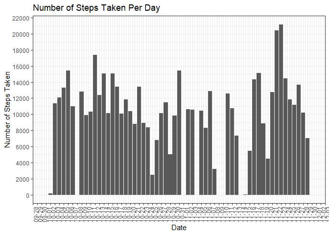
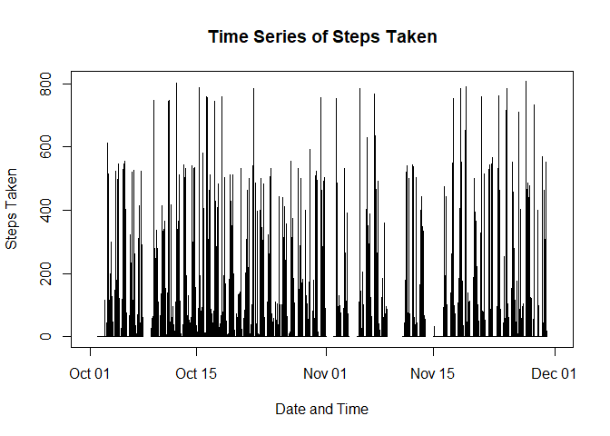
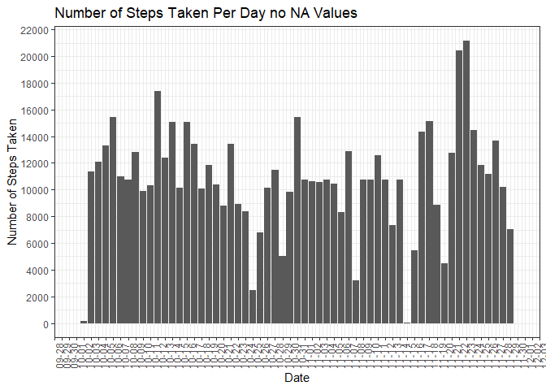
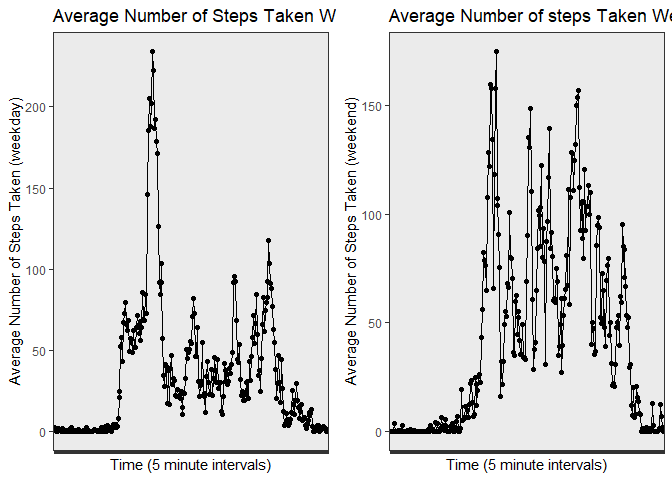

## Loading and preprocessing the data


```r
setwd("D:\\argor\\Documents\\RepData_PeerAssessment\\RepData_PeerAssessment1")
getwd()
```

```
## [1] "D:/argor/Documents/RepData_PeerAssessment/RepData_PeerAssessment1"
```

```r
activity <- read.csv("D:\\argor\\Documents\\RepData_PeerAssessment\\RepData_PeerAssessment1\\activity\\activity.csv")


activity2 <- sprintf("%04d", activity$interval)
activity3 <- format(strptime(activity2, format="%H%M"), format = "%H:%M")

activity$interval <- activity3


activity$datetime <- paste(activity$date, activity$interval, sep = " ")

stepdata <- activity[, c("steps", "datetime")]

stepdata$datetime <- strptime(stepdata$datetime, format = "%Y-%m-%d %H:%M")

stepdata$date <- as.Date(stepdata$datetime)

stepdata$time <- format(stepdata$datetime, "%H:%M:%S")

steps <- stepdata[, c("steps", "date", "time")]
```

This will create the necessary data sets we will use to answer every question, 
namely `steps` and `stepdata`.

### Creating a Histogram with Processed data

`ggplot2` and `scales` will be integral to creating a plot with x-axis ticks
that don't blend into themselves.


```r
library(ggplot2)
```

```
## Warning: package 'ggplot2' was built under R version 4.3.1
```

```r
library(scales)

ggplot(steps, aes(x=date, y=steps)) +
  geom_bar(stat = "identity") +
  scale_x_date(breaks = "1 day", labels = date_format("%m-%d"),
               limits = c(as.Date("2012-10-01"), as.Date("2012-11-30"))) +
  xlab("Date") +
  ylab("Number of Steps Taken") + 
  ggtitle("Number of Steps Taken Per Day") +
  theme_bw() + 
  scale_y_continuous(breaks = seq(0, 30000, 2000)) +
  theme(axis.text.x = element_text(angle = 90)) 
```

```
## Warning: Removed 2304 rows containing missing values (`position_stack()`).
```

<!-- -->

## What is mean total number of steps taken per day?


```r
library(dplyr)
```

```
## Warning: package 'dplyr' was built under R version 4.3.1
```

```
## 
## Attaching package: 'dplyr'
```

```
## The following objects are masked from 'package:stats':
## 
##     filter, lag
```

```
## The following objects are masked from 'package:base':
## 
##     intersect, setdiff, setequal, union
```

```r
library(knitr)
```

```
## Warning: package 'knitr' was built under R version 4.3.1
```

```r
steps_avg_med = steps %>%
  group_by(date) %>%
  summarise(avg_steps = mean(steps, na.rm = TRUE),
            med_steps = median(steps, na.rm = TRUE))

kable(steps_avg_med, caption = "Mean and Median Number of Steps Taken Per Day")
```


Table: Mean and Median Number of Steps Taken Per Day

|date       |  avg_steps| med_steps|
|:----------|----------:|---------:|
|2012-10-01 |        NaN|        NA|
|2012-10-02 |  0.4375000|         0|
|2012-10-03 | 39.4166667|         0|
|2012-10-04 | 42.0694444|         0|
|2012-10-05 | 46.1597222|         0|
|2012-10-06 | 53.5416667|         0|
|2012-10-07 | 38.2465278|         0|
|2012-10-08 |        NaN|        NA|
|2012-10-09 | 44.4826389|         0|
|2012-10-10 | 34.3750000|         0|
|2012-10-11 | 35.7777778|         0|
|2012-10-12 | 60.3541667|         0|
|2012-10-13 | 43.1458333|         0|
|2012-10-14 | 52.4236111|         0|
|2012-10-15 | 35.2048611|         0|
|2012-10-16 | 52.3750000|         0|
|2012-10-17 | 46.7083333|         0|
|2012-10-18 | 34.9166667|         0|
|2012-10-19 | 41.0729167|         0|
|2012-10-20 | 36.0937500|         0|
|2012-10-21 | 30.6284722|         0|
|2012-10-22 | 46.7361111|         0|
|2012-10-23 | 30.9652778|         0|
|2012-10-24 | 29.0104167|         0|
|2012-10-25 |  8.6527778|         0|
|2012-10-26 | 23.5347222|         0|
|2012-10-27 | 35.1354167|         0|
|2012-10-28 | 39.7847222|         0|
|2012-10-29 | 17.4236111|         0|
|2012-10-30 | 34.0937500|         0|
|2012-10-31 | 53.5208333|         0|
|2012-11-01 |        NaN|        NA|
|2012-11-02 | 36.8055556|         0|
|2012-11-03 | 36.7048611|         0|
|2012-11-04 |        NaN|        NA|
|2012-11-05 | 36.2465278|         0|
|2012-11-06 | 28.9375000|         0|
|2012-11-07 | 44.7326389|         0|
|2012-11-08 | 11.1770833|         0|
|2012-11-09 |        NaN|        NA|
|2012-11-10 |        NaN|        NA|
|2012-11-11 | 43.7777778|         0|
|2012-11-12 | 37.3784722|         0|
|2012-11-13 | 25.4722222|         0|
|2012-11-14 |        NaN|        NA|
|2012-11-15 |  0.1423611|         0|
|2012-11-16 | 18.8923611|         0|
|2012-11-17 | 49.7881944|         0|
|2012-11-18 | 52.4652778|         0|
|2012-11-19 | 30.6979167|         0|
|2012-11-20 | 15.5277778|         0|
|2012-11-21 | 44.3993056|         0|
|2012-11-22 | 70.9270833|         0|
|2012-11-23 | 73.5902778|         0|
|2012-11-24 | 50.2708333|         0|
|2012-11-25 | 41.0902778|         0|
|2012-11-26 | 38.7569444|         0|
|2012-11-27 | 47.3819444|         0|
|2012-11-28 | 35.3576389|         0|
|2012-11-29 | 24.4687500|         0|
|2012-11-30 |        NaN|        NA|


## What is the average daily activity pattern?

This section will be split into two sections:

1.A Time Series Plot of Steps Taken
2.A Table of how the average amount of steps per 5 minute interval

### Time Series Plot of Steps Taken

`stepdata` will be very useful specifically for the time series plot.


```r
plot(stepdata$datetime, stepdata$steps, xlab="Date and Time",
     ylab="Steps Taken", type="n", main = "Time Series of Steps Taken")
lines(stepdata$datetime, stepdata$steps)
```

<!-- -->

### Average Amount of Steps Taken Per Five Minute Interval


```r
library(dplyr)
library(knitr)

steps_avg_time = steps %>%
  group_by(time) %>%
  summarise(avg_steps = mean(steps, na.rm = TRUE))

kable(steps_avg_time, caption = "Average Amount of Steps Per 5min Interval")
```


Table: Average Amount of Steps Per 5min Interval

|time     |   avg_steps|
|:--------|-----------:|
|00:00:00 |   1.7169811|
|00:05:00 |   0.3396226|
|00:10:00 |   0.1320755|
|00:15:00 |   0.1509434|
|00:20:00 |   0.0754717|
|00:25:00 |   2.0943396|
|00:30:00 |   0.5283019|
|00:35:00 |   0.8679245|
|00:40:00 |   0.0000000|
|00:45:00 |   1.4716981|
|00:50:00 |   0.3018868|
|00:55:00 |   0.1320755|
|01:00:00 |   0.3207547|
|01:05:00 |   0.6792453|
|01:10:00 |   0.1509434|
|01:15:00 |   0.3396226|
|01:20:00 |   0.0000000|
|01:25:00 |   1.1132075|
|01:30:00 |   1.8301887|
|01:35:00 |   0.1698113|
|01:40:00 |   0.1698113|
|01:45:00 |   0.3773585|
|01:50:00 |   0.2641509|
|01:55:00 |   0.0000000|
|02:00:00 |   0.0000000|
|02:05:00 |   0.0000000|
|02:10:00 |   1.1320755|
|02:15:00 |   0.0000000|
|02:20:00 |   0.0000000|
|02:25:00 |   0.1320755|
|02:30:00 |   0.0000000|
|02:35:00 |   0.2264151|
|02:40:00 |   0.0000000|
|02:45:00 |   0.0000000|
|02:50:00 |   1.5471698|
|02:55:00 |   0.9433962|
|03:00:00 |   0.0000000|
|03:05:00 |   0.0000000|
|03:10:00 |   0.0000000|
|03:15:00 |   0.0000000|
|03:20:00 |   0.2075472|
|03:25:00 |   0.6226415|
|03:30:00 |   1.6226415|
|03:35:00 |   0.5849057|
|03:40:00 |   0.4905660|
|03:45:00 |   0.0754717|
|03:50:00 |   0.0000000|
|03:55:00 |   0.0000000|
|04:00:00 |   1.1886792|
|04:05:00 |   0.9433962|
|04:10:00 |   2.5660377|
|04:15:00 |   0.0000000|
|04:20:00 |   0.3396226|
|04:25:00 |   0.3584906|
|04:30:00 |   4.1132075|
|04:35:00 |   0.6603774|
|04:40:00 |   3.4905660|
|04:45:00 |   0.8301887|
|04:50:00 |   3.1132075|
|04:55:00 |   1.1132075|
|05:00:00 |   0.0000000|
|05:05:00 |   1.5660377|
|05:10:00 |   3.0000000|
|05:15:00 |   2.2452830|
|05:20:00 |   3.3207547|
|05:25:00 |   2.9622642|
|05:30:00 |   2.0943396|
|05:35:00 |   6.0566038|
|05:40:00 |  16.0188679|
|05:45:00 |  18.3396226|
|05:50:00 |  39.4528302|
|05:55:00 |  44.4905660|
|06:00:00 |  31.4905660|
|06:05:00 |  49.2641509|
|06:10:00 |  53.7735849|
|06:15:00 |  63.4528302|
|06:20:00 |  49.9622642|
|06:25:00 |  47.0754717|
|06:30:00 |  52.1509434|
|06:35:00 |  39.3396226|
|06:40:00 |  44.0188679|
|06:45:00 |  44.1698113|
|06:50:00 |  37.3584906|
|06:55:00 |  49.0377358|
|07:00:00 |  43.8113208|
|07:05:00 |  44.3773585|
|07:10:00 |  50.5094340|
|07:15:00 |  54.5094340|
|07:20:00 |  49.9245283|
|07:25:00 |  50.9811321|
|07:30:00 |  55.6792453|
|07:35:00 |  44.3207547|
|07:40:00 |  52.2641509|
|07:45:00 |  69.5471698|
|07:50:00 |  57.8490566|
|07:55:00 |  56.1509434|
|08:00:00 |  73.3773585|
|08:05:00 |  68.2075472|
|08:10:00 | 129.4339623|
|08:15:00 | 157.5283019|
|08:20:00 | 171.1509434|
|08:25:00 | 155.3962264|
|08:30:00 | 177.3018868|
|08:35:00 | 206.1698113|
|08:40:00 | 195.9245283|
|08:45:00 | 179.5660377|
|08:50:00 | 183.3962264|
|08:55:00 | 167.0188679|
|09:00:00 | 143.4528302|
|09:05:00 | 124.0377358|
|09:10:00 | 109.1132075|
|09:15:00 | 108.1132075|
|09:20:00 | 103.7169811|
|09:25:00 |  95.9622642|
|09:30:00 |  66.2075472|
|09:35:00 |  45.2264151|
|09:40:00 |  24.7924528|
|09:45:00 |  38.7547170|
|09:50:00 |  34.9811321|
|09:55:00 |  21.0566038|
|10:00:00 |  40.5660377|
|10:05:00 |  26.9811321|
|10:10:00 |  42.4150943|
|10:15:00 |  52.6603774|
|10:20:00 |  38.9245283|
|10:25:00 |  50.7924528|
|10:30:00 |  44.2830189|
|10:35:00 |  37.4150943|
|10:40:00 |  34.6981132|
|10:45:00 |  28.3396226|
|10:50:00 |  25.0943396|
|10:55:00 |  31.9433962|
|11:00:00 |  31.3584906|
|11:05:00 |  29.6792453|
|11:10:00 |  21.3207547|
|11:15:00 |  25.5471698|
|11:20:00 |  28.3773585|
|11:25:00 |  26.4716981|
|11:30:00 |  33.4339623|
|11:35:00 |  49.9811321|
|11:40:00 |  42.0377358|
|11:45:00 |  44.6037736|
|11:50:00 |  46.0377358|
|11:55:00 |  59.1886792|
|12:00:00 |  63.8679245|
|12:05:00 |  87.6981132|
|12:10:00 |  94.8490566|
|12:15:00 |  92.7735849|
|12:20:00 |  63.3962264|
|12:25:00 |  50.1698113|
|12:30:00 |  54.4716981|
|12:35:00 |  32.4150943|
|12:40:00 |  26.5283019|
|12:45:00 |  37.7358491|
|12:50:00 |  45.0566038|
|12:55:00 |  67.2830189|
|13:00:00 |  42.3396226|
|13:05:00 |  39.8867925|
|13:10:00 |  43.2641509|
|13:15:00 |  40.9811321|
|13:20:00 |  46.2452830|
|13:25:00 |  56.4339623|
|13:30:00 |  42.7547170|
|13:35:00 |  25.1320755|
|13:40:00 |  39.9622642|
|13:45:00 |  53.5471698|
|13:50:00 |  47.3207547|
|13:55:00 |  60.8113208|
|14:00:00 |  55.7547170|
|14:05:00 |  51.9622642|
|14:10:00 |  43.5849057|
|14:15:00 |  48.6981132|
|14:20:00 |  35.4716981|
|14:25:00 |  37.5471698|
|14:30:00 |  41.8490566|
|14:35:00 |  27.5094340|
|14:40:00 |  17.1132075|
|14:45:00 |  26.0754717|
|14:50:00 |  43.6226415|
|14:55:00 |  43.7735849|
|15:00:00 |  30.0188679|
|15:05:00 |  36.0754717|
|15:10:00 |  35.4905660|
|15:15:00 |  38.8490566|
|15:20:00 |  45.9622642|
|15:25:00 |  47.7547170|
|15:30:00 |  48.1320755|
|15:35:00 |  65.3207547|
|15:40:00 |  82.9056604|
|15:45:00 |  98.6603774|
|15:50:00 | 102.1132075|
|15:55:00 |  83.9622642|
|16:00:00 |  62.1320755|
|16:05:00 |  64.1320755|
|16:10:00 |  74.5471698|
|16:15:00 |  63.1698113|
|16:20:00 |  56.9056604|
|16:25:00 |  59.7735849|
|16:30:00 |  43.8679245|
|16:35:00 |  38.5660377|
|16:40:00 |  44.6603774|
|16:45:00 |  45.4528302|
|16:50:00 |  46.2075472|
|16:55:00 |  43.6792453|
|17:00:00 |  46.6226415|
|17:05:00 |  56.3018868|
|17:10:00 |  50.7169811|
|17:15:00 |  61.2264151|
|17:20:00 |  72.7169811|
|17:25:00 |  78.9433962|
|17:30:00 |  68.9433962|
|17:35:00 |  59.6603774|
|17:40:00 |  75.0943396|
|17:45:00 |  56.5094340|
|17:50:00 |  34.7735849|
|17:55:00 |  37.4528302|
|18:00:00 |  40.6792453|
|18:05:00 |  58.0188679|
|18:10:00 |  74.6981132|
|18:15:00 |  85.3207547|
|18:20:00 |  59.2641509|
|18:25:00 |  67.7735849|
|18:30:00 |  77.6981132|
|18:35:00 |  74.2452830|
|18:40:00 |  85.3396226|
|18:45:00 |  99.4528302|
|18:50:00 |  86.5849057|
|18:55:00 |  85.6037736|
|19:00:00 |  84.8679245|
|19:05:00 |  77.8301887|
|19:10:00 |  58.0377358|
|19:15:00 |  53.3584906|
|19:20:00 |  36.3207547|
|19:25:00 |  20.7169811|
|19:30:00 |  27.3962264|
|19:35:00 |  40.0188679|
|19:40:00 |  30.2075472|
|19:45:00 |  25.5471698|
|19:50:00 |  45.6603774|
|19:55:00 |  33.5283019|
|20:00:00 |  19.6226415|
|20:05:00 |  19.0188679|
|20:10:00 |  19.3396226|
|20:15:00 |  33.3396226|
|20:20:00 |  26.8113208|
|20:25:00 |  21.1698113|
|20:30:00 |  27.3018868|
|20:35:00 |  21.3396226|
|20:40:00 |  19.5471698|
|20:45:00 |  21.3207547|
|20:50:00 |  32.3018868|
|20:55:00 |  20.1509434|
|21:00:00 |  15.9433962|
|21:05:00 |  17.2264151|
|21:10:00 |  23.4528302|
|21:15:00 |  19.2452830|
|21:20:00 |  12.4528302|
|21:25:00 |   8.0188679|
|21:30:00 |  14.6603774|
|21:35:00 |  16.3018868|
|21:40:00 |   8.6792453|
|21:45:00 |   7.7924528|
|21:50:00 |   8.1320755|
|21:55:00 |   2.6226415|
|22:00:00 |   1.4528302|
|22:05:00 |   3.6792453|
|22:10:00 |   4.8113208|
|22:15:00 |   8.5094340|
|22:20:00 |   7.0754717|
|22:25:00 |   8.6981132|
|22:30:00 |   9.7547170|
|22:35:00 |   2.2075472|
|22:40:00 |   0.3207547|
|22:45:00 |   0.1132075|
|22:50:00 |   1.6037736|
|22:55:00 |   4.6037736|
|23:00:00 |   3.3018868|
|23:05:00 |   2.8490566|
|23:10:00 |   0.0000000|
|23:15:00 |   0.8301887|
|23:20:00 |   0.9622642|
|23:25:00 |   1.5849057|
|23:30:00 |   2.6037736|
|23:35:00 |   4.6981132|
|23:40:00 |   3.3018868|
|23:45:00 |   0.6415094|
|23:50:00 |   0.2264151|
|23:55:00 |   1.0754717|

as `steps_avg_time` shows, the 5 minute interval with the highest amount of
average steps is **8:35:00** at an average of 206 steps.

## Imputing missing values

### Substituting NA Values

The strategy I used for replacing missing values was by substituting them with
the mean number of steps taken using a `for` loop


```r
library(knitr)

newsteps = steps

for(i in 1:ncol(newsteps)){
  newsteps[is.na(newsteps[,i]), i] <- mean(newsteps[,i], na.rm = TRUE)
}
```

```
## Warning in mean.default(newsteps[, i], na.rm = TRUE): argument is not numeric
## or logical: returning NA
```

### Creating Histogram of Total Steps per Day with NA values substituted


```r
library(ggplot2)

ggplot(newsteps, aes(x=date, y=steps)) +
  geom_bar(stat = "identity") +
  scale_x_date(breaks = "1 day", labels = date_format("%m-%d"),
               limits = c(as.Date("2012-10-01"), as.Date("2012-11-30"))) +
  xlab("Date") +
  ylab("Number of Steps Taken") + 
  ggtitle("Number of Steps Taken Per Day no NA Values") +
  theme_bw() + 
  scale_y_continuous(breaks = seq(0, 30000, 2000)) +
  theme(axis.text.x = element_text(angle = 90)) 
```

```
## Warning: Removed 576 rows containing missing values (`geom_bar()`).
```

<!-- -->

## Are there differences in activity patterns between weekdays and weekends?

To show the differences in activity between weekdays and weekends, I created
two data sets; one filtered for weekdays and the other filtered for weekends.


```r
endsteps = steps %>%
  filter(date == "2012-10-06" | date == "2012-10-07" | date == "2012-10-13" 
         | date == "2012-10-14" | date == "2012-10-20" | date == "2012-10-21"
         | date == "2012-10-27" | date == "2012-10-28" | date == "2012-11-03"
         | date == "2012-11-04" | date == "2012-11-10" | date == "2012-11-11"
         | date == "2012-11-17" | date == "2012-11-18" | date == "2012-11-24"
         | date == "2012-11-25") %>%
  group_by(time) %>%
  summarise(avg_steps = mean(steps, na.rm = TRUE))

midsteps = steps %>%
  filter(between(date, as.Date("2012-10-01"), as.Date("2012-10-05")) | 
           between(date, as.Date("2012-10-08"), as.Date("2012-10-12")) |
           between(date, as.Date("2012-10-15"), as.Date("2012-10-19")) |
           between(date, as.Date("2012-10-22"), as.Date("2012-10-26")) |
           between(date, as.Date("2012-10-29"), as.Date("2012-11-02")) |
           between(date, as.Date("2012-11-05"), as.Date("2012-11-09")) |
           between(date, as.Date("2012-11-12"), as.Date("2012-11-16")) |
           between(date, as.Date("2012-11-19"), as.Date("2012-11-23")) |
           between(date, as.Date("2012-11-26"), as.Date("2012-11-30"))) %>%
  group_by(time) %>%
  summarise(avg_steps = mean(steps, na.rm = TRUE))
```

After creating these two data sets I plotted them using `ggplot2` and 
`gridExtra`.


```r
library(ggplot2)
library(gridExtra)
```

```
## Warning: package 'gridExtra' was built under R version 4.3.3
```

```
## 
## Attaching package: 'gridExtra'
```

```
## The following object is masked from 'package:dplyr':
## 
##     combine
```

```r
g1 <- ggplot(midsteps, aes(x=time, y=avg_steps, group = 1)) +
  geom_line() +
  geom_point() +
  xlab("Time (5 minute intervals)") +
  ylab("Average Number of Steps Taken (weekday)") +
  ggtitle("Average Number of Steps Taken Weekdays") +
  theme_bw() +
  theme(axis.text.x = element_blank())

g2 <- ggplot(endsteps, aes(x=time, y=avg_steps, group = 1)) +
  geom_line() +
  geom_point() +
  xlab("Time (5 minute intervals)") +
  ylab("Average Number of Steps Taken (weekend)") +
  ggtitle("Average Number of steps Taken Weekends") +
  theme_bw() +
  theme(axis.text.x = element_blank())

grid.arrange(g1, g2, nrow = 1)
```

<!-- -->


